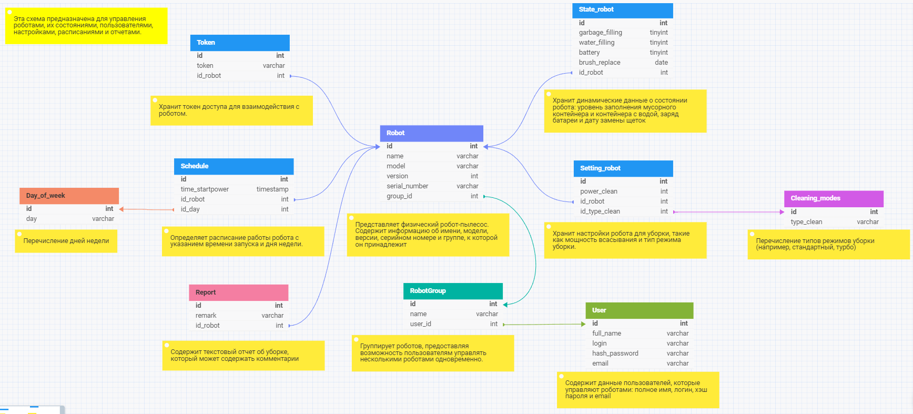
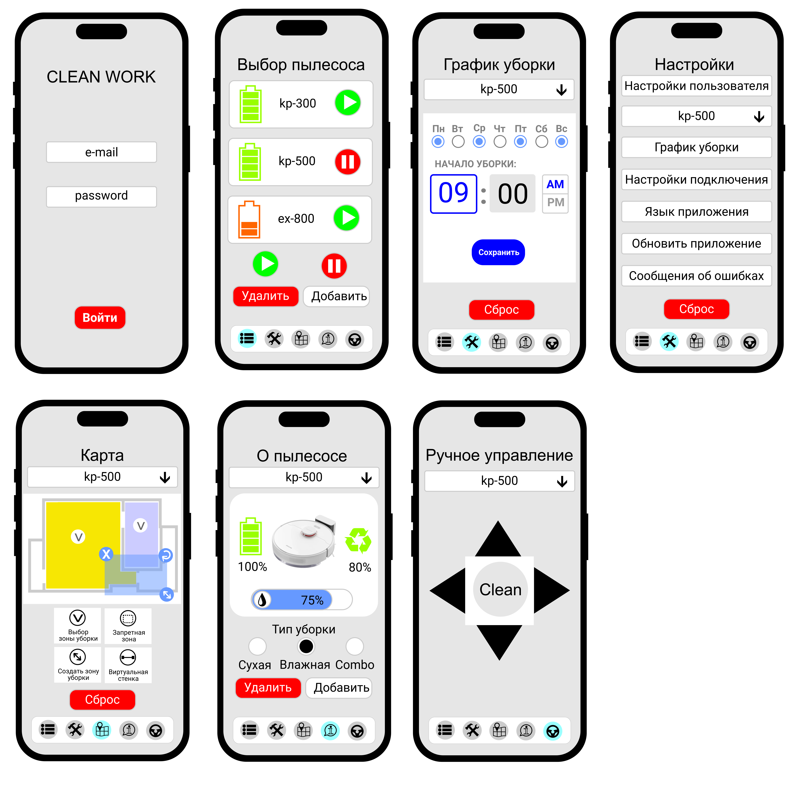

# Architecture_HW_10

## Архитектура ПО

### Урок 10. Структура приложения с пользовательским интерфейсом и базой данных (паттерн Repository)

Задание.
Доработать пункты задания Блока 1: a, b, c, d, e, f, g.

Инструменты:

https://www.figma.com/

https://app.diagrams.net/

https://www.dbdesigner.net/

https://swagger.io

### РЕШЕНИЕ:

1) UI - экранная форма пользовательского интерфейса

2) ERD-диаграмма домена 

3) Сгенерированный swagger код.

