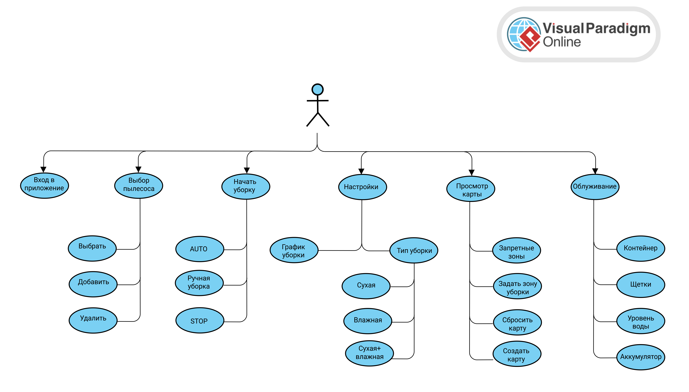

## Архитектура ПО

### Урок 10. Структура приложения с пользовательским интерфейсом и базой данных (паттерн Repository)

### ЗАДАНИЕ

Доработать пункты задания Блока 1: a, b, c, d, e, f, g.

Инструменты:

https://www.figma.com/

https://app.diagrams.net/

https://www.dbdesigner.net/

https://swagger.io

### РЕШЕНИЕ:

1) ERD-диаграмма домена облачного приложения для управления роботом-пылесосом

2) UI - графический интерфейс для мобильного управления роботом-пылесосом

3) User Case - диаграмма для управления роботом-пылесосом

